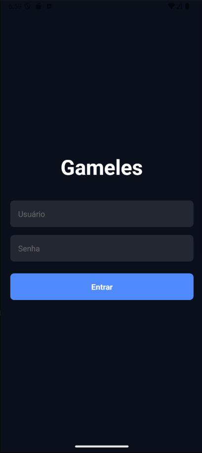

# Gameles - Catálogo de Jogos

Uma aplicação mobile desenvolvida com React Native e Expo para explorar um catálogo de jogos organizados por categorias.

## Screenshots

### Tela de Login


### Lista de Jogos


### Detalhes do Jogo


### Menu de Logout


## Funcionalidades

**Autenticação de Usuário**
- Sistema de login com usuários mockados
- Proteção de rotas
- Logout com confirmação

**Catálogo de Jogos**
- Visualização por categorias
- Cards com imagens dos jogos
- Animações de interação
- Detalhes completos dos jogos

## Tecnologias

- React Native
- Expo Router
- TypeScript
- @expo/vector-icons
- @expo/react-native-action-sheet

## Screens

- **Login**: Autenticação do usuário
- **Home**: Lista de jogos por categoria
- **GameDetails**: Detalhes completos do jogo

## Como Executar

1. Clone o repositório
```bash
git clone https://github.com/GabrielKuiawa/gameles.git
```

2. Instale as dependências
```bash
npm install
```

3. Execute o projeto
```bash
npx expo start
```

## Usuários de Teste

```json
{
  "admin": {
    "username": "admin",
    "password": "123456"
  },
  "user": {
    "username": "user",
    "password": "123456"
  }
}
```

## Tema

A aplicação utiliza um tema escuro com as seguintes cores:
- Fundo principal: `#0a0f1c`
- Destaque: `#4f8cff`
- Textos: `#fff` e `#ccc`
- Erro: `#ff4f4f`

## Estrutura do Projeto

```
gameles/
├── app/
│   ├── _layout.tsx
│   ├── index.tsx
│   ├── login.tsx
│   ├── home.tsx
│   └── GameDetails.tsx
├── components/
│   └── Card.tsx
├── mock/
│   ├── games_categorize.json
│   └── users.ts
└── types/
    └── navigation.ts
```

## Licença

Este projeto está sob a licença MIT.

---

Desenvolvido por Gabriel Kuiawa - UTFPR