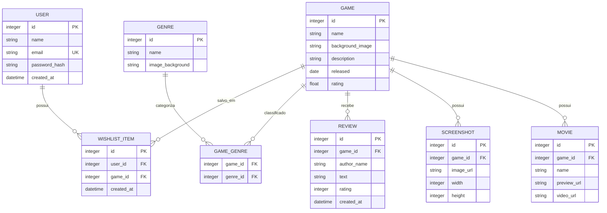

# Gameles — Catálogo de Jogos

Projeto desenvolvido para a disciplina de Programação para Dispositivos Móveis do curso de Sistemas para Internet da UTFPR. O Gameles combina uma aplicação mobile em React Native com uma API própria em Java Spring Boot, criada para centralizar as regras de negócio, a autenticação e o acesso aos dados persistidos. O projeto aplica, na prática, conceitos de desenvolvimento mobile, integração com serviços REST, modelagem relacional e organização de uma aplicação cliente-servidor.

## Sobre o app

O Gameles é um aplicativo mobile para descobrir e consultar jogos. A pessoa usuária poderá navegar por categorias, pesquisar títulos, ver informações detalhadas — como nota, plataformas, gêneros, imagens e avaliações — e manter uma lista pessoal de desejos (*wishlist*). O catálogo será integrado à API RAWG quando necessário, enquanto a API própria controlará as contas, autenticação e dados personalizados, como a wishlist.

### Funcionalidades

- [x] Listar jogos e categorias
- [x] Pesquisar jogos
- [x] Exibir detalhes, imagens, vídeos e avaliações de um jogo
- [x] Navegar entre as seções principais do aplicativo
- [ ] Implementar autenticação básica (cadastro, login e logout)
- [ ] Permitir adicionar e remover jogos da wishlist
- [ ] Exibir a wishlist da pessoa usuária
- [ ] Persistir sessão e dados da wishlist no dispositivo
- [ ] Adicionar filtros e ordenação ao catálogo

## Protótipo

O protótipo navegável e as telas do aplicativo estão disponíveis no Figma:

[Abrir protótipo do Gameles no Figma](https://www.figma.com/design/XvW8DDzVK5KlHpxnsTEj1L/Gameles?node-id=0-1&m=dev&t=GK0TbWKsGbekxdrL-1)

## Modelagem do banco de dados

### Estratégia de persistência

O back-end será uma API REST desenvolvida em Java com Spring Boot. Ela será a camada intermediária entre o aplicativo mobile, o banco PostgreSQL e serviços externos: receberá as requisições do app, validará as regras de negócio, autenticará usuários e consultará o catálogo na API RAWG. A persistência será feita com Spring Data JPA, garantindo que os dados próprios do Gameles não dependam do dispositivo.

Os jogos exibidos em listagens, buscas e detalhes serão consultados sob demanda na RAWG e não serão gravados automaticamente no banco. Um registro de jogo, seus gêneros e demais informações necessárias será salvo somente quando a pessoa usuária adicioná-lo à wishlist. Nesse momento, a API armazenará uma cópia dos dados relevantes e criará o vínculo com o usuário. Essa separação permite que, no futuro, a RAWG seja substituída ou complementada por outra API externa sem alterar as funcionalidades de conta e wishlist.

Senhas nunca serão guardadas em texto puro: a tabela de usuários armazenará apenas o hash da senha. O e-mail será único, evitando a criação de contas duplicadas.

### Entidades e relacionamentos

- **User:** armazena os dados da conta utilizados no cadastro e login.
- **Game:** representa somente os jogos que foram salvos na wishlist, preservando os dados relevantes recebidos da API externa, como nome, imagem, descrição, lançamento e nota.
- **Genre:** registra os gêneros dos jogos. Um jogo pode ter vários gêneros e um gênero pode pertencer a vários jogos; por isso, a relação é feita pela tabela associativa `Game_Genre`.
- **Wishlist_Item:** representa cada jogo salvo por uma pessoa usuária. A combinação de usuário e jogo será única, evitando que o mesmo título seja adicionado duas vezes à wishlist.
- **Review, Screenshot e Movie:** armazenam, quando necessário, avaliações e mídias vinculadas aos jogos para que os detalhes possam ser exibidos e reutilizados pela aplicação.


```mermaid
erDiagram
    USER {
        integer id PK
        string name
        string email UK
        string password_hash
        datetime created_at
    }
    GAME {
        integer id PK
        string name
        string background_image
        string description
        date released
        float rating
    }
    GENRE {
        integer id PK
        string name
        string image_background
    }
    GAME_GENRE {
        integer game_id FK
        integer genre_id FK
    }
    WISHLIST_ITEM {
        integer id PK
        integer user_id FK
        integer game_id FK
        datetime created_at
    }
    REVIEW {
        integer id PK
        integer game_id FK
        string author_name
        string text
        integer rating
        datetime created_at
    }
    SCREENSHOT {
        integer id PK
        integer game_id FK
        string image_url
        integer width
        integer height
    }
    MOVIE {
        integer id PK
        integer game_id FK
        string name
        string preview_url
        string video_url
    }

    USER ||--o{ WISHLIST_ITEM : possui
    GAME ||--o{ WISHLIST_ITEM : salvo_em
    GAME ||--o{ GAME_GENRE : classificado
    GENRE ||--o{ GAME_GENRE : categoriza
    GAME ||--o{ REVIEW : recebe
    GAME ||--o{ SCREENSHOT : possui
    GAME ||--o{ MOVIE : possui
```

## Planejamento de sprints

O prazo disponível é de 78 dias, equivalente a aproximadamente 11 semanas. O planejamento foi dividido em seis sprints: cinco ciclos de duas semanas e uma sprint final de oito dias. As funcionalidades já existentes — catálogo, busca, detalhes, mídias, avaliações e navegação — serão mantidas e integradas às novas funcionalidades.

### Sprint 1 — Back-end e fundação do banco (dias 1 a 14)

- Criar o projeto da API com Java Spring Boot e configurar a estrutura em camadas (controller, service, repository e model).
- Configurar o PostgreSQL e conectar a aplicação usando Spring Data JPA.
- Criar as entidades, migrações e relacionamentos do diagrama de banco.
- Definir os endpoints iniciais e documentar o contrato de comunicação entre aplicativo e API.

### Sprint 2 — Cadastro e autenticação (dias 15 a 28)

- Implementar cadastro de usuário com validação de nome, e-mail e senha.
- Implementar login, geração e validação de token de autenticação.
- Proteger rotas que exigem uma pessoa usuária autenticada.
- Criar no aplicativo as telas e os fluxos básicos de cadastro, login e logout.

### Sprint 3 — Integração do catálogo (dias 29 a 42)

- Integrar a API própria ao catálogo de jogos e à API RAWG.
- Persistir ou atualizar os dados mínimos dos jogos necessários para o funcionamento da wishlist.
- Ajustar listagem, busca e detalhes para consumir os endpoints definidos.
- Tratar carregamento, ausência de resultados e falhas de conexão no aplicativo.

### Sprint 4 — Wishlist (dias 43 a 56)

- Criar endpoints para adicionar, listar e remover jogos da wishlist.
- Garantir que um jogo não seja adicionado mais de uma vez para o mesmo usuário.
- Integrar as ações de salvar e remover na tela de detalhes.
- Construir a tela de wishlist com estado vazio, carregamento e atualização da lista.

### Sprint 5 — Melhorias de experiência e dados (dias 57 a 70)

- Implementar filtros e ordenação no catálogo.
- Refinar exibição de gêneros, avaliações, screenshots e vídeos.
- Melhorar mensagens de erro, feedback das ações e consistência visual conforme o protótipo.
- Revisar segurança básica da autenticação e integridade dos dados persistidos.

### Sprint 6 — Finalização e entrega (dias 71 a 78)

- Validar os fluxos completos: cadastro, login, navegação, busca, detalhes e wishlist.
- Corrigir problemas identificados durante a validação manual da aplicação e da API.
- Atualizar documentação, instruções de execução, modelagem e checklist de funcionalidades.
- Preparar a versão final para apresentação e entrega.

## Tecnologias

- React Native
- Expo e Expo Router
- TypeScript
- API RAWG
- Java Spring Boot
- PostgreSQL
- Spring Data JPA

## Como executar

1. Clone o repositório:

   ```bash
   git clone https://github.com/GabrielKuiawa/gameles.git
   ```

2. Instale as dependências:

   ```bash
   npm ci
   ```

3. Crie o arquivo de ambiente e informe sua chave da API RAWG:

   ```bash
   cp .env.example .env
   ```

   ```env
   EXPO_PUBLIC_RAWG_API_KEY=sua_chave_da_api_rawg
   ```

4. Inicie o projeto:

   ```bash
   npm start
   ```

Com o computador e o celular na mesma rede, leia o QR code exibido no terminal usando o Expo Go.

## Licença

Este projeto está sob a licença MIT.

---

Desenvolvido por Gabriel Kuiawa — UTFPR
